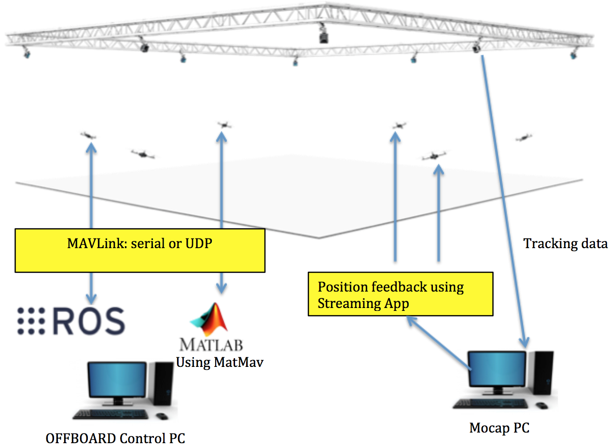

# System Architecture 


---


This section describes the overall system architecture. Each component will be briefly discussed.




The over all systems has 3 main elements:
* ##Motion capture system (OptiTrack)
  Motion capture (or ```mocap``` in brief) is used to provide high precision indoor local positions and orientation estimation of tracked objects. This is done using overhead cameras. The number of the objects the mocap system can track depends mainly on the camera types. At the time of writing this guide, RISC lab had 10 Prime17w camera that are installed in the flying arena.
  
  Objects are tracked by mounting retroflective markers on them that are rigidly attached.
  
  Elements of ```mocap```:
  * Tracking cameras (Prime17w)
  * Network switches, to connect the cameras
  * Mocap PC which runs the ```mocap``` software, Motive, that provides the tracking features.
  
* ##Object to be tracked e.g. quadrotors, ground vehicles.
Objects are considered rigid bodies in the ```mocap``` system. They can be stationary or moving. There are 2 main types of information a rigid body (object) has in the ```mocap```: position and orientation. Position is in meters. Orientation are *quatrenion* and can be converted to *Euler* angles, in radians.

```mocap``` setup is discussed in here.
* ##Controller