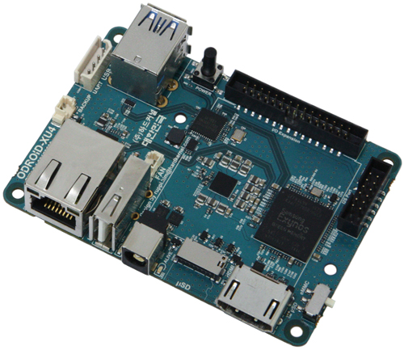

# ODROID XU4 setup


---


<div style="text-align: center;">

## List of components
* [ODROID XU4](http://www.hardkernel.com/main/products/prdt_info.php?g_code=G143452239825)
* [16GB eMMc module](http://www.hardkernel.com/main/products/prdt_info.php?g_code=G145628174287)
* [USB-UART Module Kit](http://www.hardkernel.com/main/products/prdt_info.php?g_code=G134111883934)
* [WiFi Module 4](http://www.hardkernel.com/main/products/prdt_info.php?g_code=G141630348024)
* [DC plug cable](http://www.hardkernel.com/main/products/prdt_info.php?g_code=G141440511056)
* [Ethernet cable](http://www.hardkernel.com/main/products/prdt_info.php?g_code=G141637576518)

## Setup Ubuntu 14.04
### Flashing Ubuntu image
### User account setup
## Installing packages
### Install ROS
To install ROS on ODROID or ARM-based single-board-computer, follow the [instructions](http://wiki.ros.org/indigo/Installation/UbuntuARM) that is mentioned on the ROS websites. We assume that ROS Indigo is used.

### Install OpenCV
Use the following shell commands to install OpenCV,
```sh
### INSTALL OPENCV DEPENDENCIES ###
sudo apt-get install build-essential checkinstall cmake pkg-config yasm libtiff4-dev libjpeg-dev libjasper-dev libavcodec-dev libavformat-dev libswscale-dev libdc1394-22-dev libxine-dev libgstreamer0.10-dev libgstreamer-plugins-base0.10-dev libv4l-dev python-dev python-numpy libqt4-dev libgtk2.0-dev libavcodec-dev libavformat-dev libswscale-dev libtbb2 libtbb-dev
```

```sh
### GET OPENCV SOURCE ###
cd ~
wget http://sourceforge.net/projects/opencvlibrary/files/opencv-unix/2.4.9/opencv-2.4.9.zip
unzip opencv-2.4.9.zip
rm opencv-2.4.9.zip
cd opencv-2.4.9
```

```sh
### BUILD AND INSTALL OPENCV ###
mkdir build
cd build
cmake -DCMAKE_BUILD_TYPE=RELEASE -DCMAKE_INSTALL_PREFIX=/usr/local -DWITH_OPENGL=ON -DWITH_V4L=ON -DWITH_TBB=ON -DBUILD_TBB=ON -DENABLE_VFPV3=ON -DENABLE_NEON=ON ..
make
sudo make install
```
