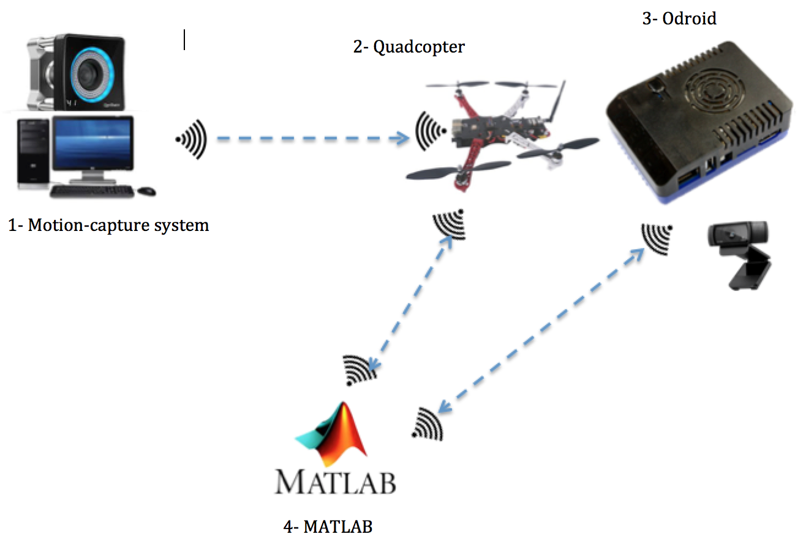

# Demo1
In this demo we will learn two things,
* Sending high-level commands  from *MATLAB* to Pixhawk, using *MATMAV*
* Getting live stream of images (into *MATLAB*) from ODROID which is mounted on a quadcopter.

As you can see from the previous figure, there are 4 main components to setup.
* Motion capture system.
* Quadcopter with Pixhawk flight controller.
* ODROID: embedded Linux computer.
* MATLAB enviornment.

## 1- Motion capture setup
Motion capture (or Mocap in short) is used to provide accurate positions and orientations in an indoor environment. The mocap setup we have in the lab is from *Optitrack* company. You can think of it as GPS system for indoor environment. The software which is used to define rigid bodies (e.g. quadcopter) is called *Motive*. Rigid bodies are defined by at least 3 reflective markers that are rigidly mounted on the object of interest.

What we need in this tutorial is to
* open *Motive* project
* define rigid bodies
* configure streaming parameters in Motive
* use the Streaming Application to send mocap info to Pixhawk.

The Mocap is assumed to be calibrated and ready to be used.

**Follow the following steps in order.**

* Open *Motive* software, and choose 'Open Existing Project'. Choose a recent project that represents the latest calibration settings.
* close the *Camera Preview* view, and leave the *Perspective View* view for 3D viewing of objects.
* place the object in the cage (e.g. quadcopter) with mounted markers.
* select markers in the *Perspective View* and create a rigid body
* 