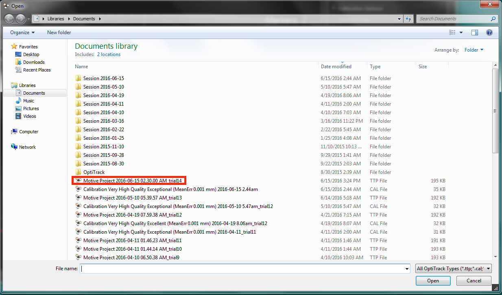

# Demo1
In this demo we will learn two things,
* Sending high-level commands  from *MATLAB* to Pixhawk, using *MATMAV*
* Getting live stream of images (into *MATLAB*) from ODROID which is mounted on a quadcopter.

As you can see from the previous figure, there are 4 main components to setup.
* Motion capture system.
* Quadcopter with Pixhawk flight controller.
* ODROID: embedded Linux computer.
* MATLAB enviornment.

## 1- Motion capture setup
Motion capture (or Mocap in short) is used to provide accurate positions and orientations in an indoor environment. The mocap setup we have in the lab is from *Optitrack* company. You can think of it as GPS system for indoor environment. 

Mocap mainly consists of cameras, network switches, and a PC with a special software. Cameras capture images which contain special *reflective markers*. Those markers are used to track objects (rigid bodies) they are attached to. Then, images from all cameras are transmitted to the PC software (called *Motive*) through the network switches, in order to do further image processing. *Motive* extracts useful information about captured rigid bodies such as position and orientation. Such information can be further transmitted through network to other PCs for further usage. Rigid bodies are defined by at least 3 reflective markers that are rigidly mounted on the object of interest.

For this tutorial, it is assumed that the Mocap is already calibrated.

What we need in this tutorial is to
* open *Motive* project
* define rigid bodies
* configure streaming parameters in Motive
* use the Streaming Application to send mocap info to Pixhawk

**Follow the following steps in order.**

* Open *Motive* software, and choose 'Open Existing Project'. Choose a recent project that represents the latest calibration settings.

* close the *Camera Preview* view, and leave the *Perspective View* view for 3D viewing of objects.
* 
* place the object in the cage (e.g. quadcopter) with mounted markers (minimum 3 markers).
* select markers in the *Perspective View* and create a rigid body

You can know your rigid body number from the *Rigid Body*, after you select the rigid body in the *Perspective View*