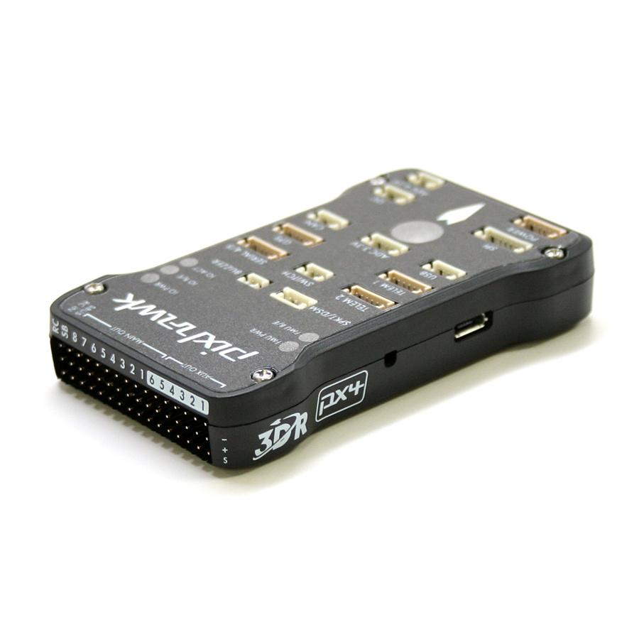

# Pixhawk Setup for Quadrotor Control

---

[Link to the Pixhawk page](https://pixhawk.org/modules/pixhawk)

##Pixhawk Autopilot

> PIXHAWK is a high-performance autopilot-on-module suitable for fixed wing, multi rotors, helicopters, cars, boats and any other robotic platform that can move. It is targeted towards high-end research, amateur and industry needs and combines the functionality of the PX4FMU + PX4IO.

See above link for the features.

In this guide, we are going to learn how to setup Pixhawk for indoor fly.