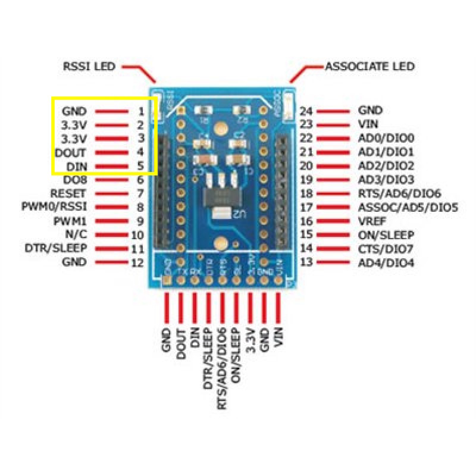

# Recommended WiFi setup
---

In this tutorial, we are going to use the *ESP8266* WiFi module to communicate with *Pixhawk* via Wifi.

Required:
* [ESP-07 ESP8266 Serial Wi-Fi Wireless Transceiver Module](http://www.dx.com/p/esp-07-esp8266-serial-wi-f-wireless-module-w-built-in-antenna-compatible-with-3-3v-5v-for-arduino-400559#.V0rfbGMwzww)
* [FTDI/USB cable](http://www.robotshop.com/en/ftdi-usb-to-ttl-serial-cable-5v.html): to flash firmware

Follow the
<a href="https://pixhawk.org/peripherals/8266">this guide</a>
to setup the ESP8266.

**NOTE**: Use `platformio run -e esp01_1m -t upload` to upload the firmware to the board.

NOTES:
  * Make sure to solder *VCC* and *CH_PD* pins togehter. See below picture.
  * To put the module in setup mode, connect *GPIO_0* to ground before powering up the device.
  * For normal, operation, DO NOT connect *GPIO_0*

ESP8266 CAN NOT tolerate 5V VCC.IT KILLS IT!
It uses 3.3V for all VCC and TX/RX signals.
The VCC from TELEM1/TELEM2 on Pixhawk provides 5V. So, Make sure to either use Logic-Level converter or the requlated pins (3.3V/Tx/Rx) of the XBee breakout board mentioned above.

