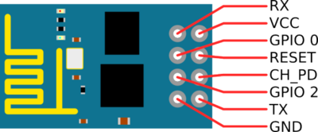

# Recommended WiFi setup
---

In this tutorial, we are going to use the *ESP8266* WiFi module to communicate with *Pixhawk* via Wifi.

Required:
* [ESP8266 module](http://www.robotshop.com/en/wifi-module-esp8266-sfe.html)
* [Logic level converter](http://www.robotshop.com/en/logic-level-converter-bidirectional.html) OR [XBee breakout board](http://www.robotshop.com/en/droids-xbee-simple-board.html)
* [jumper wires](http://www.robotshop.com/en/sfe-170mm-ff-premium-jumper-wires.html)
* Headers: [1](http://www.robotshop.com/en/sfe-right-angle-pin-headers.html), [2](http://www.robotshop.com/en/break-away-female-headers.html) ,[3](http://www.robotshop.com/en/arduino-shield-stacking-headers.html)
* [FTDI adapter](http://www.robotshop.com/en/ftdi-basic-breakout-3-3v-6-pin-header.html) to flash firmware

Follow the
<a href="https://pixhawk.org/peripherals/8266">this guide</a>
to setup the ESP8266.

NOTES:
  * Make sure to solder *VCC* and *CH_PD* pins togehter. See below picture.
  * To put the module in setup mode, connect *GPIO_0* to ground before powering up the device.
  * For normal, operation, DO NOT connect *GPIO_0*

ESP8266 CAN NOT tolerate 5V VCC.IT KILLS IT!
It uses 3.3V for all VCC and TX/RX signals.
The VCC from TELEM1/TELEM2 on Pixhawk provides 5V. So, Make sure to either use Logic-Level converter or the requlated pins of the XBee breakout board mentioned above.

