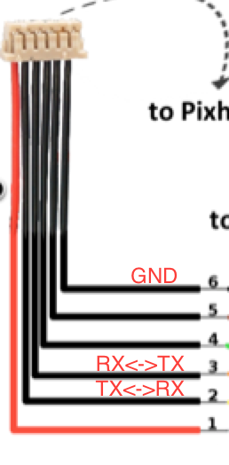

# Recommended WiFi setup
---

In this tutorial, we are going to use the *ESP8266* WiFi module to communicate with *Pixhawk* via Wifi.

Required:
* [ESP-07 ESP8266 Serial Wi-Fi Wireless Transceiver Module](http://www.dx.com/p/esp-07-esp8266-serial-wi-f-wireless-module-w-built-in-antenna-compatible-with-3-3v-5v-for-arduino-400559#.V0rfbGMwzww)
* [FTDI/USB cable](http://www.robotshop.com/en/ftdi-usb-to-ttl-serial-cable-5v.html): to flash firmware

Connect the FTDI/USB cable to the ESP module. The orange cable (TX) is connected to (RX) pin on the module. Yellow cable (RX) is connected to (TX) pin on the module. Connect the power (red) and ground (black).

Follow the guide in the link below to flash the *mavesp8266* firmware.

Follow the
<a href="https://pixhawk.org/peripherals/8266">this guide</a>
to setup the ESP8266.

**NOTE**: Use `platformio run -e esp01_1m -t upload` to upload the firmware to the board.

Connect the module to the Pixhawk as follows.

* **NOTE:** You first need to make sure that you configured `TELEM2` port to be used for ESP link with baud 921600. You can do this, by first, connecting to Pixhawk via USB, and modify the `SYS_COMP` parameter in the **System** tab on the left.
* Now you can power-on the Pixhawk with the WiFi module connected.
* Then, search for the *Pixracer* WiFi netwrok. Connect to that network with the password *pixracer*.
* Open QgroundControl and connect using UDP connection.

Now you are connected to Pixhawk via WiFi. The Wifi Module is in Access point mode by default, and it creates it's own WifI network (Pixracer). If you wish to connect to your own local WiFi network.
* In QGC, go to the **WiFi Bridge** tab on the left and choose *station mode*.
* Write the desired network name and password in the appropriate field.
* Restart Pixhawk, and the WiFi module should try

