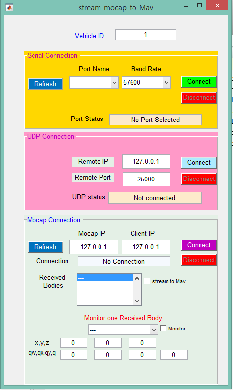

# Setup streaming application

---
In this section, we learn how to install and use the streaming application, *OptiStream*. *OptiStream* is used to receive rigid bodies information (i.e. position & orientation), and stream them to the desired *Pixhawk*.

